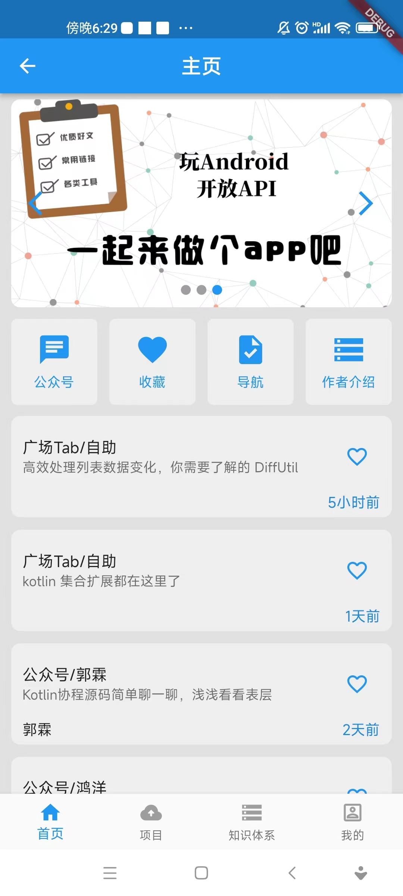
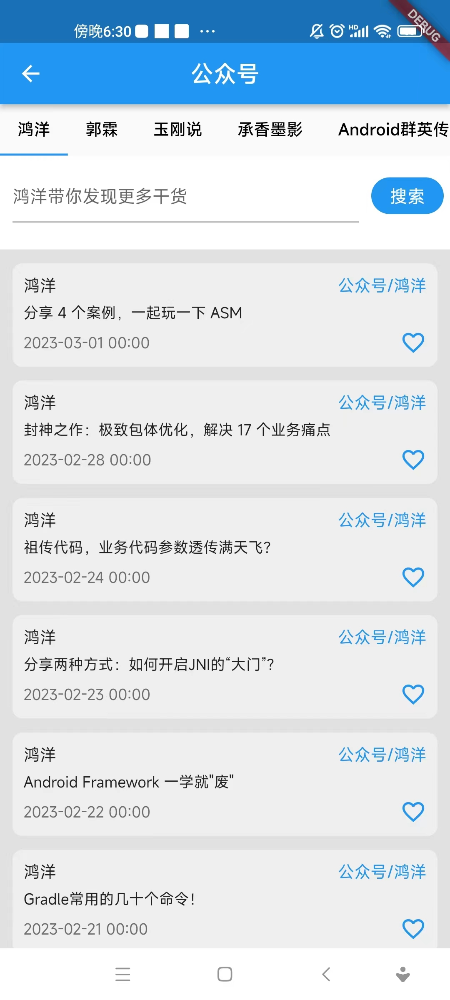

# flutter_wan_android

这是一个基于flutter写的玩android项目，所有数据都是来源于开源api。

### 关于作者

Email &nbsp;&nbsp;: 718603390@qq.com

## app下载二维码


# app下载链接（复制不要直接点击进去）
app下载链接: https://www.pgyer.com/nmn4

### App结构简介

1.所有dart类都是根据功能划分，这样的好处是容易找，修改也不会影响多个目录，发现bug回去找问题也容易。
错误的做法是将所有的ui类放在一个目录，所以的model放在一个目录。

2.项目的整体架构是get实现ui与逻辑分离

3.一个标准get架构（但是不得不说有些内部界面还是没有重构）

4.ui设计参考其他开源项目（api官网中的java版本的wanandroid界面）

5.所有数据都是来源于开源api[开源api](http://www.wanandroid.com/blog/show/2)

### app部分界面展示






### App目录结构

>- |--lib
>  - |-- core (核心类)
>  - |-- custom (自定义类，可复用的)
>  - |-- generated (自动生成的无需关注)
>  - |-- l10n (国际化)
>  - |-- network (网络)
>  - |-- test (flutter demos)
>  - |-- ui (ui类)
>  - |-- utils (工具类)

### ui目录结构

>- |--ui
>  - |-- common (通用)
>  - |-- login (登录)
>  - |-- main (main)
>  - |-- register (注册)
>  - |-- welcome (欢迎页)

### 路由
```dart
 static List<GetPage> getPageList = [
    GetPage(
      name: Routers.welcome,
      page: () => const WelcomePage(),
      binding: WelcomeBinding(),
    ),
    GetPage(
      name: Routers.loginPage,
      page: () => const LoginPage(),
      binding: LoginBinding(),
    ),
    GetPage(
      name: Routers.mainPage,
      page: () => const MainPage(),
      binding: MainBinding(),
    ),
    GetPage(
      name: Routers.homePage,
      page: () => const HomePage(),
      binding: HomeBinding(),
    ),
    GetPage(
      name: Routers.authorPage,
      page: () => const AuthorPage(),
    ),
    GetPage(
      name: Routers.dHPage,
      page: () => const DHPage(),
      binding: DHBinding()
    ),
    GetPage(
      name: Routers.synopsisPage,
      page: () => const SynopsisPage(),
    )
  ];

```
### 网络请求
```dart
class LoginModel extends BaseModel {
  ///login
  static void login(String name, String pwd) async {
    await BaseModel.dataManager.login<LoginEntity>(name, pwd, (data) async {
      if (data == null) {
        SmartDialog.showToast("errMsg: data==null");
        return;
      }
      await BaseModel.dataManager.setLoginStatus(true);
      await BaseModel.dataManager.setLoginName(data.nickname ?? name);
      await Get.offNamed(Routers.mainPage);
    }, (err) {
      SmartDialog.showToast("${err.errMsg}");
    });
  }
}
```


# update status

# v1.2.0 
1.添加statusWidget   
2.使用statusWidget替换项目的列表原本的loading   
3.使用statusWidget替换知识体系的列表原本的loading   
4.使用statusWidget替换收藏的列表原本的loading   
5.优化项目主页与detail页ui代码   
6.优化知识主页与detail页ui代码 

# v1.2.1 
1.优化一些代码【懂的都懂😀】 

# v2.0.0   
1.使用getx完成welComePage的改造   
2.使用getx完成loginPage的改造   
3.使用getx完成MainPage的改造   

# v2.0.0.3  
1.添加知识体系的失败重试  
2.优化MyEasyRefresh的封装   

# v2.0.0.4 
1.添加项目详情列表的失败重试  

# v2.0.0.5 
1.添加作者介绍页  

# v2.0.0.6 
1.添加作者介绍页 
2.添加导航页 

# v2.1.0.0 
1.添加导航功能 

# v2.1.0.1
1.优化查看大图

# v2.1.1.1 
1.优化我的界面 
2.优化项目最后一个item的bottom padding为0问题 

# v2.1.1.2   
1.展示版本号   

# v2.1.1.3 
1.“登录页”与“我的页”展示版本号   

# v2.1.1.4 
1.优化“收藏页”未登录情况 

# v2.1.1.5
1.升级app版本号

# v2.1.1.6 
1.添加加载进度条 
